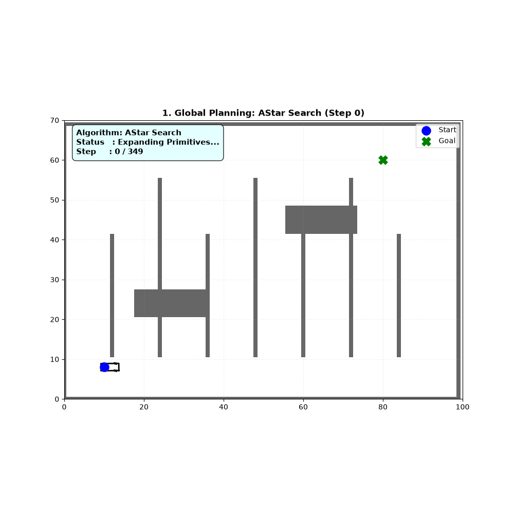
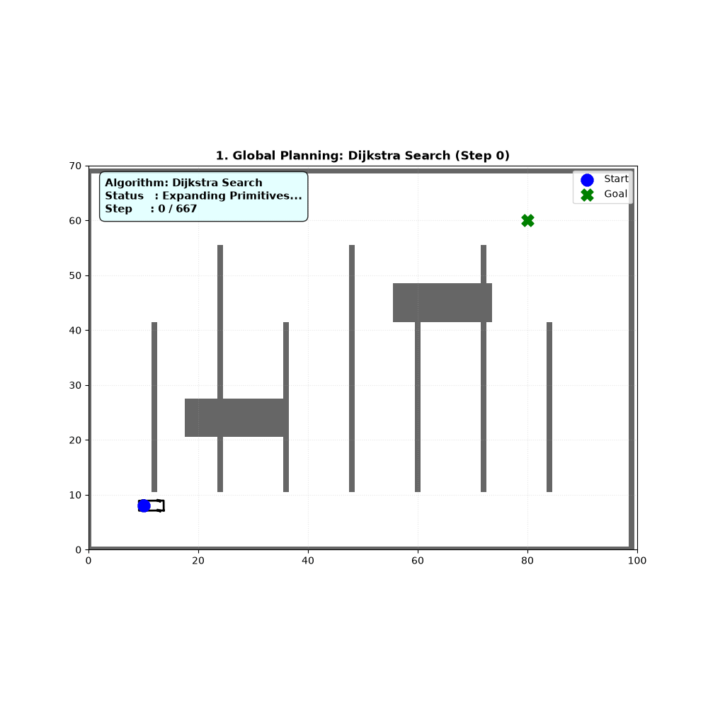
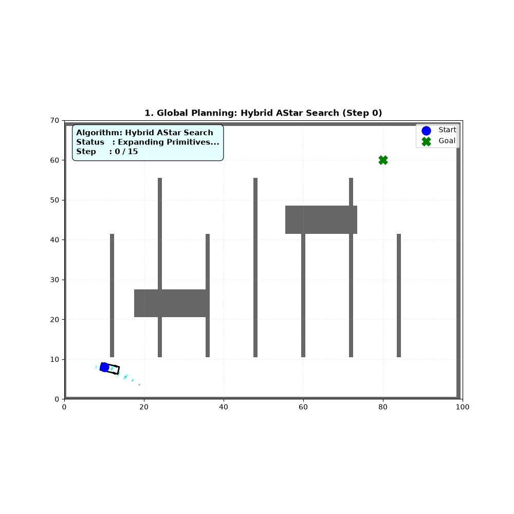

# Autonomous Vehicle Motion Control  & Path Planning (WIP)

A modular, high-fidelity Python framework for simulating and benchmarking classic autonomous vehicle lateral and longitudinal motion controllers side by side in real-time.

##  Features
* **utils**         :  Contains different paths to test the algorithms.
* **Controllers**   :  Pure pursuit with Dynamic Lookahead, Stanley, LQR and MPC using **cvxpy** library.
* **Visualization** :  Vehicle plotter and animation files.
* **Vehicle**       :  Vehicle configuration and state.
---
##  Repository Architecture

```text
├── Controllers/
│   ├── pure_pursuit_controller.py  # Geometric path tracker
│   ├── Stanley_controller.py       # Front-axle error control logic
│   ├── MPC_controller.py           # Model Predictive Control optimizer
│   ├── LQR_controller.py           # Linear Quadratic Regulator tracker
│   └── pid_speed_controller.py     # Longitudinal velocity control loop
├── Planning/
│   ├── AStar.py                    # AStar Implementation Algorithm
│   ├── Dijkstra.py                 # Dijkstra Implementation Algorithm
│   ├── FrenetOptimalPlanner.py     # Frenet Implementation Algorithm
│   ├── Hybrid_AStar.py             # HybridAStar Implementation Algoritm
│   ├──StateLattice.py              # State Lattice Implementation Algorithm
├── Vehicle/
│   ├── Vehicle_config.py           # Wheelbase, limits, and vehicle specs
│   ├── vehicle_state.py            # Kinematic state models (x, y, yaw, v)
|   ├── controlInput.py             # acceleration and steering control
│   └── vehicle.py                  # Plant vehicle model and step physics
├── utils/
|   ├── Frenet                      # Consists of all files required for Frenet
|   ├── Hybrid                      # Consists of all files required for Hybrid AStar
|   ├── StateLattice                # Consists of all files required for State Lattice
│   ├── path_generation.py          # Path boundary calculations
|   ├── reference_path.py           # Reference data of paths
|   ├── Different_map.py            # Different maps from simple to complex
|   ├── gridmap.py                  # Basic shapes and boundary definition
|   ├── node.py                     # Node definition for path planning
|   ├── Smooth_Curve.py             # smoothening the Path generated by planners(Dijstra/AStar)           
│   └── geometry.py                 # Mathematical transformations
├── Visualization/
    ├── VehiclePlotter.py           # Underlying canvas rendering pipeline
    ├── PurePursuit.py              # Standalone PP routine / data packager
    ├── Stanley.py                  # Standalone Stanley routine / data packager
    ├── MPC.py                      # Standalone MPC routine / data packager
    ├── LQR.py                      # Standalone LQR routine / data packager
    ├── AStar.py                    # Standalone LQR routine / data packager
    ├── LQR.py                      # Standalone LQR routine / data packager
    └── AllinOne.py         # 2x2 Master Subplot Runner & GIF Exporter
```
## Controllers


## Path Planning 
<table>
  <tr>
    <td></td>
    <td></td>
  </tr>
  <tr>
    <td></td>
    <td></td>
  </tr>
</table>

